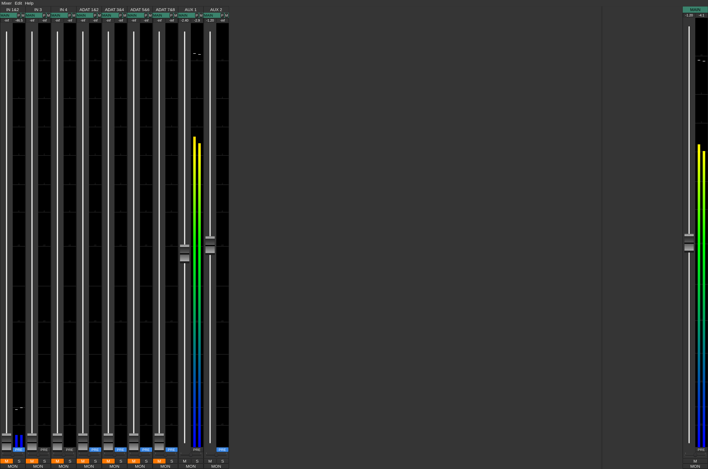

jack_mixer -- Jack Audio Mixer
==============================

**jack_mixer** is a GTK+ JACK audio mixer app with a look & handling similar to
hardware mixing desks. It has lot of useful features, apart from being able to
mix multiple JACK audio streams.



It is licensed under GPL version 2 of, check the file [COPYING] for
more information.

This is LADI variant of jack_mixer. More than 10 years after the original author
gave up of the project maintenance to communty,
user experience under lash or ladish was degraded in series of commits
while promoting nonsm/newsm/raysession as replacement.
The complaints in recent years by original author were ignored and or rejected by
currently active developers/maintainers.

This unfortunate state of affairs led the original author of jack_mixer, Nedko Arnaudov,
into getting back on maintaing jack_mixer, starting with version 18.

The LADI jack_mixer project is bound to principles like *diversity*,
as outlined in Ubuntu Code of Conduct.

Here is list of regressions in the community version to be (or aleady) fixed:

* removal of pylash support in same commit that adds nsm protocol support.
* prefixing of all log messages with `[jack_mixer]` messages (already fixed, by revert, but change can be made non-monoculturlistic and then reapplied).

If you have patch that distinguishes between non-sm and new-sm protocols while
not causing regressions in lash support, submit it to the original author (Nedko Arnaudov).

You can find the LADI version at https://gitea.ladish.org/LADI/jack_mixer
You can find the community version at https://rdio.space/jackmixer/

## Installation

To build and install jack_mixer run:

```console
meson setup builddir --prefix=/usr --buildtype=release
meson compile -C builddir
[sudo] meson install -C builddir
```

Please read the file [INSTALL.md] for more information and requirements.


## Using MIDI CCs to control jack_mixer

MIDI Control Change messages (CCs) can be used to control volume,
balance/panorama, mute, and solo of input and output channels.

The default controllers for added channels are chosen using a predefined
algorithm: the first free controller starting from #11, first for volume, next
for balance/panorama, then mute and finally solo.

So, if you don't delete channels, CC#11 will control the first channel's
volume, CC#12 the balance/panorama, CC#13 the mute and CC#14 the solo switch.
CC#15 will control the second channel' volume, CC#16 it's balance/panorama, and
so on.

It is also possible to set other CCs when creating a channel, or afterwards
from the channel properties dialog (accessible from the menu or by double
clicking on the channel name).

MIDI CC values (0-127) are mapped to dBFS using the current slider scale for
the corresponding channel.


## Authors and Acknowledgements

jack_mixer was written and is supported by Nedko Arnaudov.
For a list of contributors see the file [AUTHORS].

K-meter implementation taken from jkmeter, licensed under the GPL 2, by Fons
Adriaensen.

## Feedback and Contributing

For related discussions, you are invited to join
[Libera.Chat](https://libera.chat/) channel #ladi

If you want to get involved with jack_mixer's development, documentation or
translation, please read the [contributing guide].

[AUTHORS]: ./AUTHORS
[COPYING]: ./COPYING
[INSTALL.md]: ./INSTALL.md
[contributing guide]: ./docs/CONTRIBUTING.md
